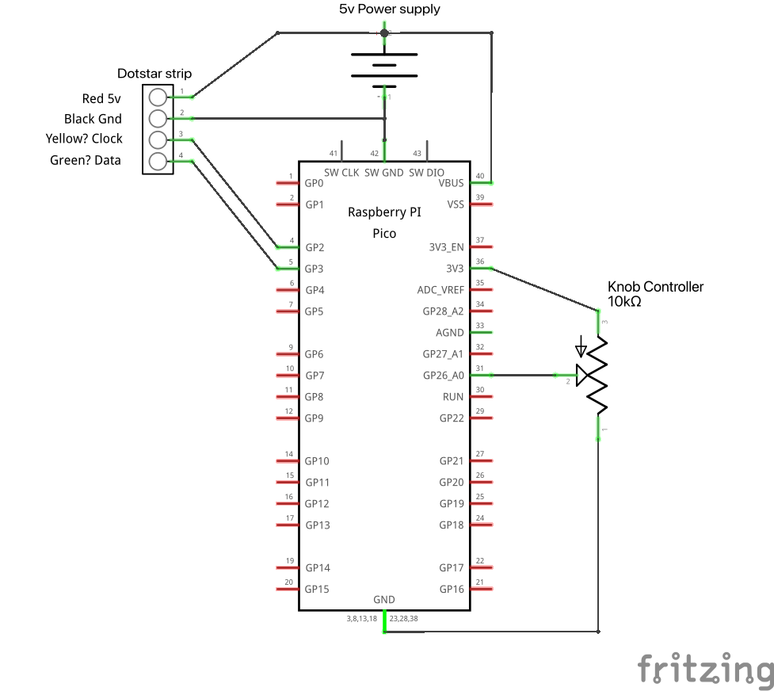

# ▄ ▄▄▄ ▄▄▄ ▄▄▄ ▄▄▄   ▄▄▄ ▄ ▄
## A 1-d game "engine" for Micropython and Raspberry Pi Pico

▄ ▄▄▄ ▄▄▄ ▄▄▄ ▄▄▄   ▄▄▄ ▄ ▄ (1d) is a simple and loose framework or engine for making 1-dimensional (spatial) games that work on the Raspberry Pi Pico platform using Micropython. It is designed for use with LED strips as a 1-dimensional display, supports the common protocols for 5v display (DotStar/NeoPixel/WS2812B) and is quick to play around with. It includes some example games to try.

▄ ▄▄▄ ▄▄▄ ▄▄▄ ▄▄▄   ▄▄▄ ▄ ▄ was made by [Ben Kirman](https://ben.kirman.org) during the IGGI Game Jam in York, January 2025. It is open source but only sporadically maintained, please feel free to fork.

## Requirements
- A Raspberry Pi Pico
- A programmable LED strip (DotStar/NeoPixel/WS2812B)
- A power supply appropriate for the purpose. Note that long LED strips can draw a lot of power at full brightness. This can damage the Pi if powered by the USB connector. Adafruit's [NeoPixel Űberguide](https://learn.adafruit.com/adafruit-neopixel-uberguide/powering-neopixels) is essential reading regardless of the type of LED strip you use.
- Some knowledge of basic electronics and how to wire things to the Pico.
- As much Micropython knowledge as fits your scope! [This book](https://store.rpipress.cc/products/get-started-with-micropython-on-raspberry-pi-pico-2nd-edition) is a fantastic intro for beginners to Micropython and the Pico.
- Some kind of controller? There is built in support for a simple potentiometer (knob) and a [Pimoroni Qw/ST Gamepad](https://shop.pimoroni.com/products/qwst-pad?variant=53514400596347). Anything else (soil moisture sensor? accelerometer? internet api?) you can implement easily as a custom controller with a couple of lines of code.

## Design Goals

The Pi Pico is not hugely powerful and we can't do really complex stuff like a big game engine, but it is super versatile, super cheap and can be hooked into all sorts of devices, widgets, sensors and so on, relatively easily, and there is a bunch of interesting peripherals designed for it.

This makes it a great choice for hacking together simple games, especially alt ctrl games, that can sit in public/open spaces. Everything is powered off 5v so with a USB power bank or three AAs you can install your games just about anywhere.

The problem I found is that I bought [tons of cool bits](https://shop.pimoroni.com/collections/pico) and then never found the motivation to hook it together. So, when a game jam gave me some time, I wanted to lay the groundwork of a simple game engine I could use to quickly make different games, without panicking about rewriting everything all the time.

My aim was to:
- Abstract input, output(display) and game logic, so that I can make a controller once, then use it for multiple games, or vice versa.
- Simple to understand and to hack into tiny pieces as appropriate
- Help give a head start for rapid game design with an unusual platform.

It is mainly good for that kind of hacking. If you are working on a bigger project with specific requirements you'd be much better writing something from scratch.

## Caveats
It was hacked together in a few days and is extremely barebones. There is no error management and it is loosely organised. I've attempted to make all the files logical and readable, so should be easy enough to modify and use for your own setup. You might just prefer to make your own but this way of thinking is good for my experiments.

I am also not a massively experienced Micropython expert although I've done some bits and bobs. There's definitely more efficient, more pythonic, ways of approaching this engine. Feel free to fork and improve. 

Logically, there is also a fairly tight coupling between Controllers and Games, because your game will expect specific elements to appear in the controller dictionary (e.g. 'L': True, when the left d-pad is pressed). So you can't swap out controllers easily, but this way means any interesting alt control system/sensors can be implemented.

# How to Use
Download all the files and folders and copy everything to the Pico. Here is a sketch of the circuit for the default game: a Flappy Bird-like game with a potentiometer and 144 LED DotStar display. Note that the Clock and Data wires might not be yellow and green for your LED strip. This example code will not work for a Neopixel strip but those strips are supported by the engine if you swap the line that sets up the display in main.py.

Either wire that up, or start fiddling immediately. I really hope that by simply reading the code and comments you can see what is going on. Really it is not that complex.
The main parts are as follows:

## main.py
This shows the overarching logic - it sets up the controllers, displays and game, then hosts the main loop. This is quite simple but flexible for doing weird things. (multiple displays? multiple controllers? audio?)

## Controller1d
Expand this class to add a custom controller. One of the best things about messing with the Pico is the range of sensors and buttons that can be wired together to make something new.

## Game1d
This hosts the game logic. Your game gets initialised, and then gets notified each frame of: the state of all the controllers, and the current state of a specific display. You can then edit the display and return it to be pushed to the output.

## Display1d
If you have a different kind of display/output you want to use, you should subclass this. Check out the Dotstar and Neopixel examples for a demo. This is designed for LED strips but anything that can be passed a 1d array of values can work as a display (a bunch of servos? a cat feeder? a terrifying robot?)

# Future Improvements
The goal isn't to make a behemoth single purpose game engine, but just to provide a basic platform to make lots of simple games for LED strips without having to do everything from scratch each time. As I do more experiments (I have some other controllers I want to make) I'll add the code but there's no plan. If you fancy hacking about with LED strips and a Pico hopefully this will be useful for you.
